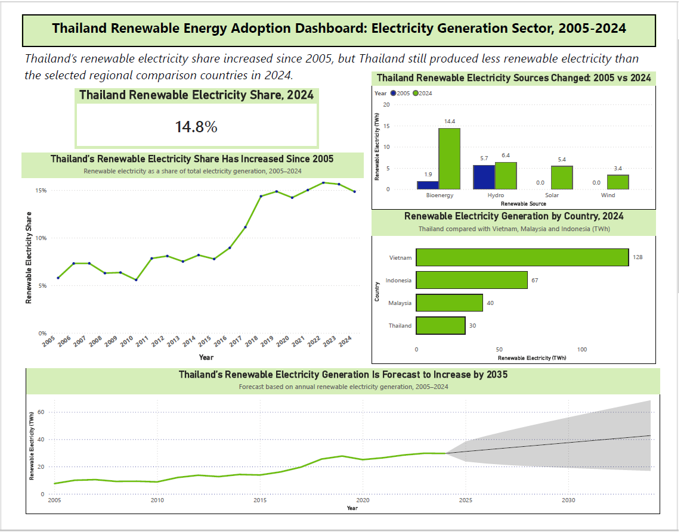

# ⚡ Thailand Renewable Energy Transition Analysis (2005–2035)

> **Business Intelligence and Analytics**  
> *Author: Analytics Consultant*

---

## Executive Summary
This repository contains a comprehensive Business Intelligence project analyzing Thailand’s renewable electricity generation trends from **2005 to 2025**, comparing performance against selected ASEAN peers (Vietnam, Malaysia, Indonesia), and forecasting renewable generation through **2035**.

---

## Interactive Dashboard Overview



---

## Key Research Questions & Findings

### 1. Renewable Electricity Share (%) in Thailand (2005–Present)
* **Trend Analysis:** Tracks the evolution of renewable energy adoption in Thailand over two decades.
* **Policy Drivers:** Evaluates the impact of national frameworks such as the Alternative Energy Development Plan (AEDP) and Feed-in Tariffs (FiT).

### 2. Renewable Source Mix Evolution
* **Energy Mix:** Breakdown of solar, wind, hydro, and bioenergy sources.
* **Key Insights:** Highlights shifts in dominant fuel sources driven by policy incentives and technology cost reductions.

### 3. ASEAN Regional Comparative Analysis
* **Benchmarking:** Comparison of Thailand’s renewable electricity share against **Vietnam, Malaysia, and Indonesia**.
* **Regional Context:** Analysis of how differing national energy policies and natural resource availability impacted transition speeds.

### 4. 2035 Renewable Generation Forecast & Analyst Ethics
* **Projection:** Predictive model forecasting Thailand's renewable electricity output by **2035**.
* **Analyst Ethics & Governance:** 
  * Transparent communication of model uncertainty and confidence intervals.
  * Discussion on potential executive misinterpretations and ethical considerations in BI reporting.

---

## 📁 Repository Structure

```text
├── README.md                   <-- Project overview & executive summary
├── .gitignore                  <-- Git ignore configuration
├── data/
│   ├── raw/                    <-- Raw data (Ember / IEA / IRENA sources)
│   └── processed/              < Cleaned and transformed datasets
├── docs/
│   ├── Report_ISYS6013_Assignment03.pdf  <-- Full consulting report
│   └── Data_Decisions_Log.md   <-- Log of data transformation decisions
├── pbix/
│   └── Thailand_Renewable_Energy_Analysis.pbix  <-- Interactive Power BI Dashboard
└── assets/
    └── dashboard_overview.png  <-- Dashboard screenshot for preview
